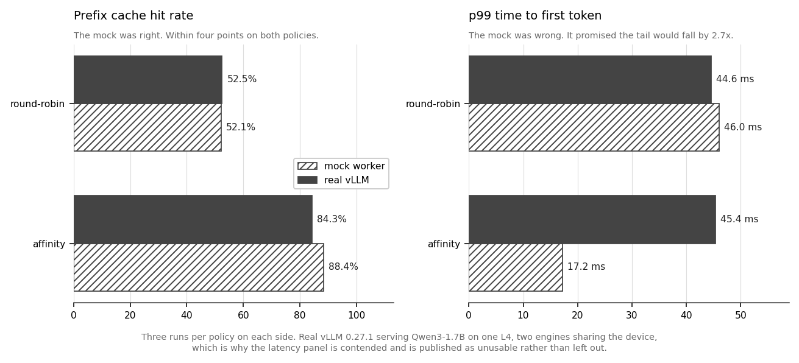
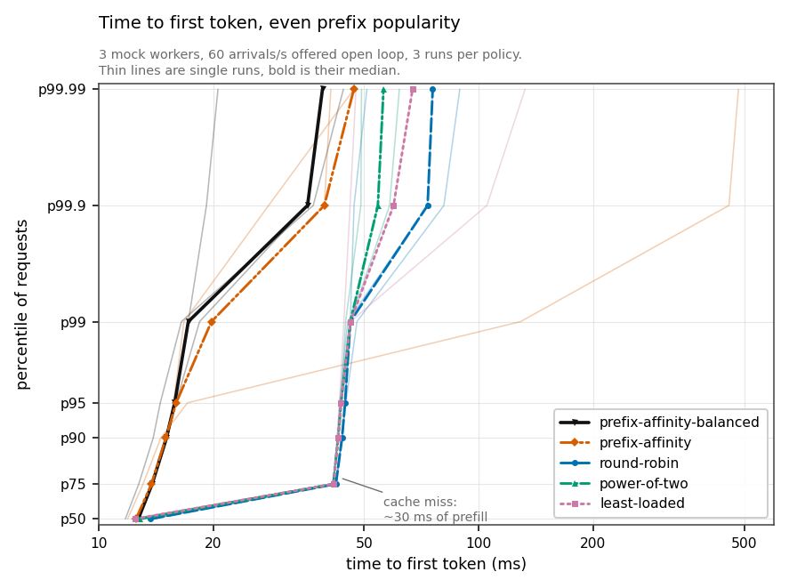
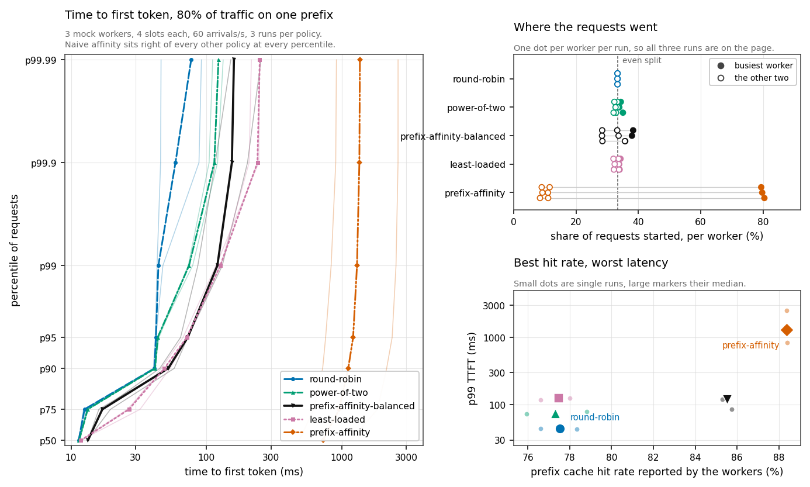
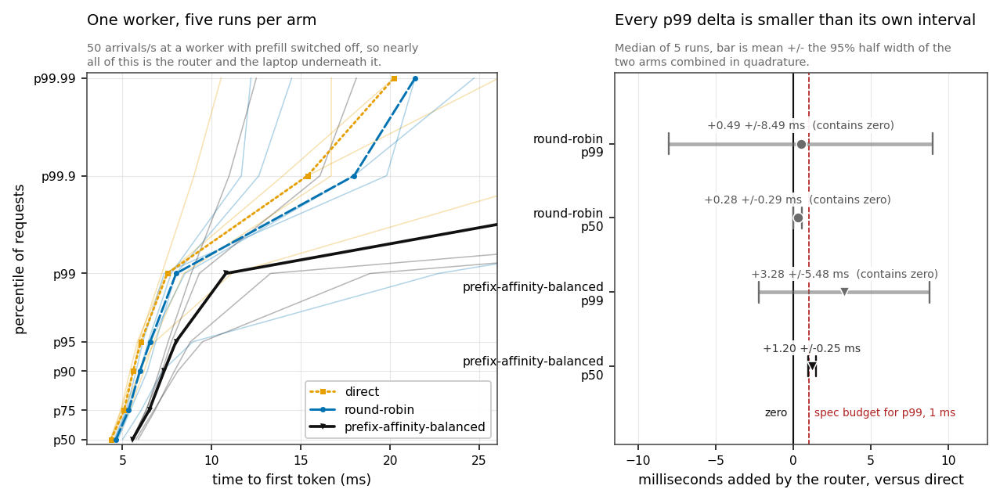
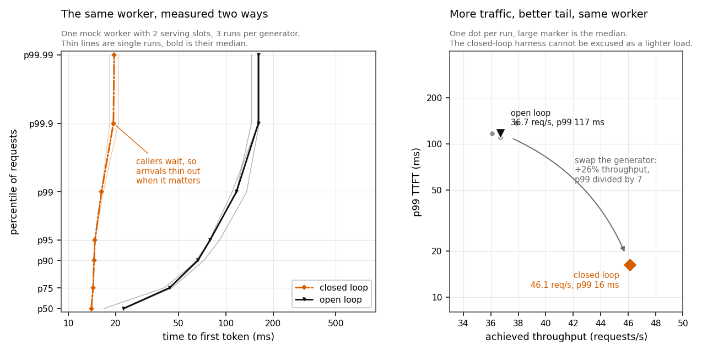

# Warmpath

Warmpath is a KV-cache-aware request router for LLM inference fleets. It is an
OpenAI-compatible HTTP proxy, written in Rust, in front of N vLLM workers. For
each request it picks the worker most likely to already hold the prompt's
prefix in KV cache, weighed against queue depth and memory pressure. A
cache-blind load balancer spreads requests that share a prefix across every
replica, and the reuse is lost.

The repository holds the router and `warmpath-bench`, a benchmark harness for
comparing routing policies. The harness exists because most published numbers
in this space come from vendors running workloads nobody else can see. Every
number below regenerates with `make bench`, the data behind every chart is
committed, and the workloads where the router loses are documented with the
same care as the ones where it wins.

## Against a real engine



Everything in this router was built and tuned against a simulated worker. On
2026-04-06 it met real vLLM for the first time: version 0.27.1 serving
Qwen3-1.7B, two engines sharing one rented L4, each capped at 112 KV blocks to
reproduce the cache scarcity the simulations use.

The engines reported a 52.5% prefix cache hit rate when round-robin scattered
the traffic and 84.3% when the router gathered it by prefix. The mock had
predicted 52.1% and 88.4%. A worker cannot report those two numbers unless the
router cuts prompts at the same block boundaries the engine uses, so the chat
template rendering, the tokenizer, and the block hash chain agree with vLLM.
That was the largest open risk in the project, since a mismatch would have
shown up as a mediocre hit rate rather than an error.

The mock had also predicted that the higher hit rate would cut p99 time to
first token by 2.7x. On real hardware the p99 stayed still, 44.6ms under
round-robin against 45.4ms under affinity. A cache hit saves real time on an
L4, about 25ms on a 190-token prompt sent to an idle engine, and two engines
taking turns on one device add more contention than that. Mean time to first
token did improve by 11% with no overlap between the groups, which
`RESULTS.md` records rather than promotes, because the policy is sold on the
median and the tail. One device also cannot show a worker saturating while
another idles, so this run says nothing about tail latency under cache-aware
routing. Settling that needs two GPUs, and it is the main thing still open.

The same session measured the router's own cost against a real engine and
found a 40ms stall that had been in the proxy from the beginning. The first
run said the router added 40.17ms at the median with an interval of 0.63ms.
Work scales with the prompt, and a cost that lands on the same tenth of a
millisecond three runs in a row is a timer. Forty milliseconds is Linux's
delayed acknowledgement waiting out Nagle's algorithm, and neither of the
proxy's sockets set `TCP_NODELAY`. With both sockets fixed, the same
measurement on the same hardware gave +1.84ms with an interval that contains
zero, in agreement with what the mock had reported all along. The stall never
fires over loopback, so months of laptop measurements could never have found
it.

One caveat on this section. The rented machine was deleted before the
harness's run directories were copied off it, so these numbers are backed by
console transcripts in `results/gpu-2026-04-06/` rather than by the raw
per-request records every other result in this repository carries. The README
in that directory lists exactly what is missing.

## How a request is routed

The router renders the full conversation through the model's own chat
template, tokenizes it with the model's own tokenizer, and cuts the token
stream into 16-token blocks, the same size vLLM uses. Each block's hash chains
in its parent's hash, so one hash identifies an entire prefix. Rendering only
the latest message is a known bug in this space and silently degrades matching
on multi-turn traffic, so the whole conversation goes through every time.

The block index is a flat map from block hash to a bitset of workers. Because
the hash chain already encodes the whole prefix, one map lookup per block
answers the question a radix tree would, and `docs/DESIGN.md` records choosing
the map over the tree. The index learns from the router's own dispatches and
models eviction itself, leaf first, since evicting the head of a chain strands
every block behind it. A wrong index entry costs one cache miss and can never
cause a failure.

Two requests carrying the same long prefix can arrive a millisecond apart,
before either has finished and taught the index anything. Blocks of a
dispatched request are therefore reserved for its worker until it completes,
so a burst of shared prefixes routes together.

Six policies are switchable in config: `round-robin`, `least-loaded`,
`power-of-two`, and `first` as cache-blind baselines, plus `prefix-affinity`
and `prefix-affinity-balanced`. The balanced form scores each worker on prefix
match ratio combined with whichever of queue headroom and KV headroom is
tighter, and it abandons affinity for shortest-queue routing when the fleet is
imbalanced past a threshold. The naive form ignores load on purpose and stays
in the field so the comparison contains its failure mode.

Also in the router: SSE streaming with output byte-identical to what the
worker wrote, client disconnects that cancel the upstream request and free the
worker slot, worker state polled from each worker's `/metrics` in vLLM's own
format, health checking with ejection and re-admission, one retry on another
worker when the first never answered, session affinity via an `x-session-id`
header, and Prometheus metrics with a Grafana dashboard.

## Where cache-aware routing pays



Everything in this section and the next ran against mock workers. Only the
section above touched a GPU.

Three workers, ten shared prefixes of 256 words each, every request carrying
one prefix plus its own short question, offered open loop at 60 requests a
second. Each worker holds 112 blocks against a working set near 200, so no
single worker can hold everything and the fleet can.

| policy | p50 TTFT | p99 TTFT | 95% CI on p99 | hit rate |
|---|---:|---:|---:|---:|
| round-robin | 13.7 ms | 46.0 ms | [43.0, 49.7] ms | 52.1% |
| least-loaded | 12.5 ms | 46.0 ms | [42.8, 48.1] ms | 52.8% |
| power-of-two | 12.8 ms | 46.0 ms | [43.6, 47.6] ms | 52.9% |
| prefix-affinity-balanced | 12.7 ms | **17.2 ms** | [15.0, 19.8] ms | 88.4% |

The three cache-blind policies land on the same p99 to the tenth of a
millisecond, because nothing is overloaded and the tail is made of cache
misses. Balanced affinity takes the hit rate from 52% to 88% and cuts the p99
from 46.0ms to 17.2ms, with confidence intervals that do not overlap.

The win holds inside a band, and all three of its boundaries are measured in
`RESULTS.md`. The working set must exceed one worker's cache, or rotation
already hits on nearly everything. In aggregate the fleet must still have room
for it, or the tail is full misses under every policy. The third boundary is
skew: past the point where the hot prefix fits in every cache, rotation gets
the hit rate for free.

## Where it stops working



On traffic where 80% of requests share one prefix, round-robin wins outright:
44.2ms p99 against balanced affinity's 120.5ms, with a 77.5% hit rate it gets
without trying, because heavy skew puts the hot prefix in every worker's
cache. Skew makes the caching problem easy and the balancing problem hard,
which inverts the intuition that skew is where this technique should shine.

The same workload shows what optimizing for hit rate alone does. Naive prefix
affinity posts the best hit rate in the field, 88.3%, and a median 64 times
worse than round-robin, because it drives 80% of traffic onto the one worker
holding the hot prefix until that worker saturates and throughput falls below
the offered rate. The metric that looks like success climbs the whole time.

Cutting each worker's cache so the fleet total sits just below the working set
moves the crossover somewhere else. The hit rate goes from 31% to 81% and the
median improves 3.4x, while the p99 does not move at all, because eviction
churn never stops and about one request in a hundred misses completely under
every policy. Those figures come from their own capacity-constrained run and
do not combine with the 46.0 to 17.2ms result above.

A stale load signal turned out worse than none. `least-loaded` posted a p99
near three times round-robin's at an identical hit rate and spread, because
queue depth is polled every 100ms and every decision inside one window piles
onto the same snapshot. `power-of-two` sat between the two, as its reputation
says it should.

## What the router itself costs



Measured on a laptop against the mock worker, with one worker in every arm so
nothing here is a routing decision. Being a proxy costs under about 0.3ms at
the median, an amount smaller than its own confidence interval. Doing the full cache-aware work, rendering,
tokenizing, hashing, and querying the index, costs 1.20 +/-0.25ms at the
median, and roughly two thirds of that is the tokenizer. The figure is a
ceiling rather than a fixed property, since a multi-turn session re-sends its
history every turn and per-session caching of the tokenized prefix is
specified and unimplemented.

The spec asks for under 1ms added at p99, and that figure is unresolved after
three attempts, twice on a laptop and once on a shared GPU. Every p99 delta
came back smaller than its own confidence interval, and one early attempt
reported the router as 4.33ms faster than no router at all, which is what a
measurement without resolution looks like. Resolving it needs the load
generator, the router, and the worker on machines that are doing nothing else.
Until that run exists, the requirement stays recorded as unverified.

## The harness



`warmpath-bench` is open loop by construction. The arrival schedule is
computed before the first request goes out, request *i* dispatches at its
scheduled time whatever happened to request *i-1*, and latency is measured
from the intended dispatch time. A run whose generator falls behind its
schedule, or whose error rate passes one percent, is marked invalid and
excluded from its campaign, with the reason recorded. Every run carries its
config, its seed, and its git SHA, and campaigns report medians with 95%
confidence intervals across at least three runs.

The reason for the open-loop design is measurable on this repo's own mock
worker. A closed-loop generator, two callers each waiting for a response
before sending the next, moved more traffic than the open-loop one and
reported a p99 seven times better, 16.2ms against 116.9ms. When a response is
slow, a closed-loop caller simply does not send the next request, so arrivals
thin out exactly when a queue would have formed. A routing change evaluated
that way is evaluated in a regime where tail latency has been engineered away.

## Open questions

The project is at R0.5, the ship point. Everything that runs without a GPU is
done, and the one-GPU session above closed the credibility gate. Still open:

- The router's predicted hit rate runs 8.9 points above what the engines
  report. Likely causes are the in-flight reservations, which credit a worker
  with blocks a request has not finished writing, and an eviction model that
  is the router's own guess rather than vLLM's.
- Tail latency under cache-aware routing on real hardware, and the cost of the
  skewed-traffic hotspot on real engines. Both need two devices.
- The sub-millisecond p99 overhead figure, on quiet separate machines.
- Session affinity is implemented and tested, and it has never influenced a
  published number. Every benchmarked request is a first turn,
  and prefix affinity already sends a follow-up turn to the worker that served
  the one before it.

## Layout

| Path | What it is |
|---|---|
| `crates/warmpath` | The router: config, index, policy, worker pool, proxy path |
| `crates/warmpath-core` | Prompt rendering, tokenization, block hashing |
| `crates/warmpath-bench` | The load generator and statistics harness |
| `crates/warmpath-mock` | Mock inference worker for GPU-free development |
| `config/warmpath.toml` | Router configuration |
| `deploy/` | Prometheus scrape config, Grafana dashboard and provisioning |
| `compose.yaml` | Router, three mock workers, Prometheus, Grafana |
| `docs/DESIGN.md` | Decisions, their costs, and what breaks at 100 workers |
| `docs/GPU-RUNBOOK.md` | The R0.5 validation session, in the order to do it |
| `results/gpu-2026-04-06/` | The real vLLM session, as console transcripts |
| `Dockerfile` | Builds the router and the mock worker into one image |
| `scripts/reproduce.sh` | Regenerates every published number, behind `make bench` |
| `scripts/plot.py` | Redraws every chart from committed data |
| `scripts/co-demo.sh` | The coordinated-omission comparison |
| `scripts/policy-compare.sh` | Routing policies on one workload shape |
| `scripts/policy-matrix.sh` | Every policy against every workload shape |
| `scripts/overhead.sh` | What the router itself costs, against one worker |
| `scripts/validate-hit-rate.sh` | Router's predicted hit rate against the workers' own |
| `scripts/fetch-model.sh` | Downloads the model tokenizer and chat template |

## Running it

The whole stack, with three workers, Prometheus, and a Grafana dashboard:

```
docker compose up --build
```

The router is then on `http://localhost:8080` and Grafana on
`http://localhost:3000` with the dashboard already loaded and no login. The
workers are mocks, so this is somewhere to watch the router route rather than a
measurement of inference.

To run it from source instead, the router wants the target model's tokenizer
and chat template, so it cuts prompts into the same blocks a worker will. Only
those two files are needed, without the weights:

```
make fetch-model
```

Then two terminals. First the worker:

```
make run-mock
```

Then the router:

```
make run
```

Then send it a request:

```
curl -N http://127.0.0.1:8080/v1/chat/completions \
  -H 'content-type: application/json' \
  -d '{"model":"mock-model","stream":true,"max_tokens":16,
       "messages":[{"role":"user","content":"hello"}]}'
```

## Measuring it

Every number published in `RESULTS.md` regenerates from one command. It takes
about an hour and starts and stops everything it needs:

```
make bench
```

The same pipeline at toy settings, to check the machinery works before
committing an hour to it. Output goes to `results/smoke` and is not
publishable, since a single short run cannot support a confidence interval:

```
make bench-smoke
```

The pieces, if you want one on its own:

```
make policy-matrix
make co-demo
make overhead
```

Each run writes a directory under `results/` holding `report.json` (config,
seed, git SHA, validity, latency summaries), `records.jsonl` (one line per
request), and `percentiles.csv` (ready to plot). Everything except the
per-request record stream is committed, so the data behind every published
number is in the repository.

`warmpath-bench` works against any OpenAI-compatible endpoint, so it can
measure other routers and bare engines too:

```
cargo run --release -p warmpath-bench -- run --target http://your-endpoint:8000
```

## Development

`make check` runs the same gate as CI: format check, clippy with warnings
denied, and the test suite.

## Design

`docs/DESIGN.md` covers the decisions, what each one costs if it is wrong, and
what breaks at a hundred workers. `automated_docs/architecture.md` describes
the structure as built. `docs/GPU-RUNBOOK.md` is the session to repeat when
two GPUs become available.

## License

Apache-2.0. See `LICENSE`.
