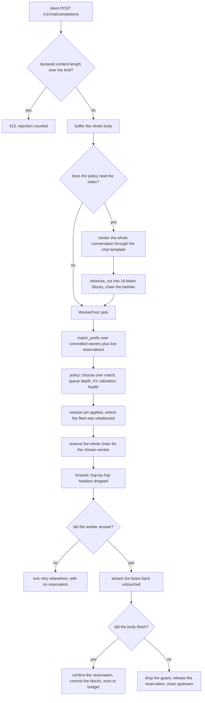

# Design

Warmpath is an OpenAI-compatible proxy. For each request it picks the worker
most likely to hold that request's prompt prefix in KV cache already. This file
records why the code looks the way it does, what else was on the table, and
where the design stops working as the fleet grows.

`automated_docs/architecture.md` describes the modules and the data flow as
built. This file stays at the level of decisions and points there for structure.

Written against R0.4. Every measured number quoted below comes from
`RESULTS.md`, and every claim about behaviour is checked against the code.

## The request path



Four parts carry a request:

- **Prompt builder.** Turns a body into a chain of block hashes.
- **Block index.** Says how many leading blocks of that chain each worker
  probably holds.
- **Policy.** Weighs that answer against what the workers report about
  themselves.
- **Proxy.** Streams the response back byte for byte.

## Decisions

### A flat map from block hash to a worker bitset

The spec calls for a radix tree over block-hash sequences, and that is what
SGLang's router uses. The code has a `HashMap<BlockHash, u64>` instead, where
the `u64` is a bitset of worker indices, plus per-worker bookkeeping for
eviction.

The reason is in `warmpath-core::blocks`. Block hash *i* is computed from block
*i-1*'s hash and block *i*'s token ids, so it already encodes every token before
it. Two prompts share hash *i* only when they agree on the whole prefix. A tree
would exist to answer "which workers hold this prefix", and the chained hash
answers it with one map lookup per block. `match_prefix` walks the chain
carrying a bitset of workers still matching, and writes each worker's answer
once at the block where it dropped out, so a lookup costs O(prefix blocks +
workers).

What the tree buys and the map does not is descendant structure: knowing which
blocks continue which. Reuse-aware eviction wants that, and it is Appendix A3.
Some of it is already here. Inside `WorkerBlocks`, every block entry carries a
parent hash and a child count, which is what makes leaf-first eviction possible.
So the gap between the two structures is narrower than the spec's wording
suggests.

**Cost of being wrong.** If a future hash function stops chaining, prefix
queries stop working and the map has to become a tree. That is a rewrite of one
module with a hard test suite already around it. The hash function is expected
to be replaced at R0.5 to match vLLM's, and vLLM's is also chained, so the risk
is small and it is visible.

### Leaf-first eviction rather than plain LRU

Each worker gets a block budget, and the index models eviction when the budget
is exceeded. Plain LRU over blocks was the first implementation and a failing
test killed it.

The failure is structural. A chain is reachable only from its head, because
prefix matching walks blocks in order and stops at the first missing one. The
oldest block of a chain is its first block. Plain LRU therefore evicts the head
and strands everything behind it: the worker keeps holding those blocks, and no
request can ever match them again. Modelled hit rate goes to zero while modelled
memory stays full. Real engines evict leaves for the same reason, since a block
with a cached child cannot be dropped without stranding the child.

So `WorkerBlocks` keeps a `leaves` map of blocks with no cached child, keyed by
last use, and evicts the oldest of those. A chain under pressure is eaten from
the tail, and prefix matching degrades one block at a time.

**Cost of being wrong.** The index models the engine's eviction rather than
reading it. If vLLM's real policy differs enough, the index claims prefixes a
worker has dropped, and those requests go somewhere that has to re-prefill. The
price is latency. Nothing has checked this model against a real engine yet.
R0.5 is where the router's predicted hit rate meets
`vllm:prefix_cache_hits_total`.

### An approximate index, with the event-driven backend deferred

Two ways to know what a worker holds. Infer it from the router's own dispatches,
or subscribe to vLLM's `BlockStored` and `BlockRemoved` events over ZMQ and
decode msgpack. The committed scope builds the first. The second is Appendix A2
and may never be built.

Inference needs nothing from the worker, so it runs against any
OpenAI-compatible backend with no second wire protocol to get wrong. Its
weakness has two parts. It only knows what this process dispatched. And it
guesses at capacity, since `index.block_budget` defaults to 65,536 blocks per
worker, a configured number rather than a reading of the GPU.

The event backend would close both. Blocks the router never caused become
visible, real eviction replaces the model of it, and a restarted router
recovers its view. The bill for that is a ZMQ dependency, an envelope format
that changes shape with data-parallel mode, a replay path for recovering after
a subscriber gap, and a race against routing decisions that the reservation
mechanism already covers.

**Does the `BlockIndex` trait earn its keep today?** No. There is one
implementation behind an `Arc<dyn BlockIndex>`, so every request pays three
virtual calls that a concrete type would not need. That cost is nothing next to
the 1.2ms of fingerprinting, and the retrospective already names the trait as
mild over-engineering if A2 never lands.

The honest defence is narrower than "it lets a second backend slot in". The
trait's shape was drawn from what the approximate backend needs. `commit` means
"this request finished, so attribute its blocks", which is an inference verb; an
event-driven backend would want reconciliation there instead, plus a replay
entry point and per-worker subscriber state the trait has no place for. If A2
lands, the trait changes shape.

What the seam does mark is the one place a fix for horizontal scaling has to go,
and that argument is in the 100-worker section below.

**Cost of being wrong.** An index entry that is wrong costs a cache miss. The
code holds that line everywhere. A poisoned lock is recovered rather than
propagated. A body the router cannot parse yields no fingerprint and routes on
load. No correctness invariant depends on the index being right.

### In-flight block reservation

When `WorkerPool::pick` chooses a worker it builds a `Reservation` over the
request's whole block chain, and `match_prefix` treats reserved blocks as
matchable alongside committed ones.

Without it, a burst breaks the router. Two requests carrying the same long
prefix can arrive a millisecond apart, before either has finished and taught the
index anything. Both score as complete misses, both fall through to the
load-based branch, and they land on different workers. That is the scattering
the router exists to prevent, and it happens exactly under the burst traffic
where prefix sharing is highest. `worker.rs` has the test:
`a_second_request_with_the_same_prefix_follows_the_first_before_it_finishes`.

Reservations are counted per worker rather than flagged, so one of two
concurrent requests ending does not clear the blocks. The reservation releases
on `Drop`, which is the same shape as the response body's `StreamGuard`. Using
one shape for both means a cancelled request cannot clean up the stream and leak
the index entry.

**Cost of being wrong.** A leaked reservation makes a worker look like it holds
a prefix forever, and that entry is never evicted, because reservations sit
outside the per-worker budget. The drop guard is what prevents it, and the
guard is the only path. A reservation that is too optimistic in the other
direction, where the request fails after dispatch, costs one misrouted follow-up
request.

### Match ratio against the tighter headroom, plus a hard override

`prefix-affinity-balanced` runs two mechanisms. The first is a hard test: if
`max_load > balance_abs_threshold` and `max_load > balance_rel_threshold ×
min_load`, affinity is abandoned and the request goes to the shortest queue with
reason `balance-override`. Both conditions must hold, because a fleet at one
request against zero has an infinite ratio and means nothing.

The second mechanism runs below that override, and gives every healthy worker a
score:

```
(1 - load_weight) × match_ratio + load_weight × min(queue_headroom, memory_headroom)
```

Queue headroom is measured against the busiest worker, since the router cannot
know a worker's absolute capacity. The scale adapts to the fleet. Memory
headroom needs no such trick, because the worker already reports KV utilization
as a fraction of its own capacity. Taking the smaller of the two means a worker
with an empty queue and 98% KV cannot pass as idle. One test holds both queues
at zero so KV alone decides, which is the only way to show that the second
signal is used.

The alternative was a single combined load number. That loses the case the
second signal exists for: a worker can look free by queue depth while having no
room for another sequence.

**Cost of being wrong.** The weighting is a guess. `load_weight` defaults to
0.3, `cache_threshold` to 0.2, `balance_abs_threshold` to 8, and
`balance_rel_threshold` to 2.0. None of these were tuned against a workload.
The measured consequence is in `RESULTS.md`: on skewed traffic the balanced
policy gives up three points of hit rate against naive affinity, keeps
throughput, and still posts a p99 of 120.5ms against round-robin's 44.2ms. Some
of that gap is the override firing on a stale load signal, and the two costs
cannot be separated with the current instrumentation. The override's threshold
arithmetic also degenerates at large fleet sizes, which is below.

### Buffering the request body

`proxy::proxy` buffers the whole body before routing, for every policy. The
declared `content-length` is checked against `server.max_request_bytes` (4MB by
default) before anything is read, and a chunked body that overruns the limit is
caught by `to_bytes` and reported as a bad request.

Streaming the body through was the alternative, and it is what a plain proxy
would do. It cannot work here. The routing decision depends on the whole
rendered conversation, and the conversation is JSON in the body. The router
would have to either route before it knows the prompt, which is round-robin with
extra steps, or hold the upstream connection open while parsing incrementally,
which is a JSON streaming parser for no gain.

Two things make buffering cheap in practice. The measured cost of the
round-robin arm, which buffers and proxies and never reads the prompt, is
+0.28ms at p50 against talking to the worker directly, and that number is
smaller than its own confidence interval. And the buffered body is a
`bytes::Bytes`, so the clone the first dispatch takes to keep a copy for a
possible retry is a refcount bump rather than a copy of the body.

**Cost of being wrong.** Memory in flight is bounded by `max_request_bytes ×
concurrent requests`, so the 4MB default at a thousand concurrent requests is
4GB of worst-case buffer. Nothing enforces a fleet-wide bound on that today. The
other cost is latency for large bodies: the worker sees nothing until the last
byte arrives at the router.

## What breaks at 100 workers

The non-goals cap the project at "one model, N replicas", and every number in
this repo was produced against three mock workers on one laptop. A hundred
workers would hit the following, roughly in this order.

### The router refuses to start

`index::MAX_WORKERS` is 64, because the owner set for a block is a `u64`
bitset. `Config::validate` rejects a config with more workers than that, and
`ApproximateIndex::new` asserts the same bound. A hundred workers fails at
startup with a clear message.

Widening to `u128` buys 128 workers and keeps `match_prefix` in registers.
Beyond that the bitset stops being a register trick and becomes a `Vec<u64>`,
which puts an allocation or a fixed array on the matching path. `WorkerPool::pick`
also declares four `[T; MAX_WORKERS]` stack arrays per request, about 1.6KB at 64
workers, and that grows with the constant.

### The balance override stops meaning anything

The relative test is `max_load > balance_rel_threshold × min_load`, where
`min_load` is the minimum over healthy workers. One idle worker sets `min_load`
to zero, and the right-hand side collapses to zero, so the test passes whenever
the busiest worker has any load at all. The override then reduces to its
absolute condition alone: busiest worker deeper than 8.

At three workers all three are usually busy, so this rarely bites. At a hundred
workers there is almost always an idle one. Affinity would be off fleet-wide
most of the time, and the policy would behave as least-loaded with extra
tokenization. The fix is to compare against a percentile or the mean rather than
the minimum, and it is a few lines.

### The load signal gets old in proportion to fleet size

`state::poll_workers` is one tokio task for the whole fleet. It walks the
endpoint list, awaits each fetch in turn, then sleeps for `poll_interval_ms`. So
the real poll period is the interval plus the sum of every worker's response
time, and it grows linearly with N. A hundred workers at 5ms each puts a sweep
at half a second on its own.

This matters because `RESULTS.md` already shows a 100ms poll interval producing
herding at three workers: `least-loaded` posted a p99 of 126.7ms against
round-robin's 44.2ms, with an identical hit rate and an identical spread of
requests, so the difference is not cache behaviour. It is every routing decision
inside one poll window reading the same snapshot and piling onto the same
"least loaded" worker. Making the window longer makes that worse.

Health detection scales the same way, since `unhealthy_after` counts sweeps
rather than seconds.

One sick worker used to be able to freeze the whole sweep. The poller shares the
proxy's HTTP client, whose read timeout is measured in tens of seconds because a
long generation is healthy, so a metrics endpoint that accepted a connection and
then said nothing held the loop for a minute while every other worker's state
went stale. The metrics fetch now carries its own timeout of one poll interval,
on the grounds that a reading arriving later than the next poll was due is worth
nothing. A regression test stalls one worker and asserts the next one is still
read.

What remains is the sequential sweep itself. Making it a bounded concurrent fan
out would keep the period flat in N, and it has not been done, because at three
workers there is nothing to see.

### Index memory

Committed entries are bounded by `worker_count × block_budget`. At the default
budget of 65,536 blocks that is 6.55 million per-worker entries at 100 workers,
against 196,608 at three.

Counting struct fields: each `Entry` holds a clock (8 bytes), an
`Option<BlockHash>` parent (16), and a child count (8), against an 8-byte key,
so roughly 40 bytes of payload before hash-table overhead. The `leaves` BTreeMap
adds 16 bytes for the subset with no cached child. The global `owners` map holds
an 8-byte key and an 8-byte bitset per distinct hash. Multiplying through puts
the index somewhere near 400MB at 100 workers. That is arithmetic on a struct
definition and not a measurement, and nothing in the repo measures index memory
today.

The budget itself is also a guess. 65,536 blocks at 16 tokens is a million
tokens of KV per worker, configured rather than read. At 100 heterogeneous
workers a single global budget stops being defensible.

### One process, one lock

`ApproximateIndex` is a single `RwLock<State>`. Every request takes a read lock
for `match_prefix` and a write lock for `reserve_blocks`. Every completion takes
a second write lock for `commit`, which runs the eviction loop while holding it.
So each request is two write-lock acquisitions against one lock, each held
across a loop over its whole block chain.

The measured runs push 59 requests a second across three workers. The same rate
per worker at 100 workers is near 2,000 a second, which is 4,000 write
acquisitions a second on one lock. That extrapolation is arithmetic, not a
measurement, and the point is only that it moves from irrelevant to worth
profiling.

Striping the index by hash is the obvious answer, and it fits the flat-map
design: `match_prefix` walks blocks one at a time, so each lookup can go to a
different stripe. Per-worker eviction bookkeeping would have to move or be
duplicated, since eviction needs a per-worker view that a hash stripe does not
have.

The session map has its own version of this. `SessionAffinity` is a single
`Mutex<HashMap>` with a default capacity of 100,000, taken twice per request
that carries a session id. On the insertion that fills it, `evict_oldest_half`
allocates a Vec of every entry's clock, sorts it, and retains. One unlucky
request pays a 100,000-element sort while holding the lock, on the routing path.
An intrusive LRU with O(1) eviction would take the spike away. Sharding the map
by session hash deals with the contention underneath it.

### Sharding the router is where the approximate index stops working

The single-process bottleneck has an obvious answer, which is to run several
routers. That breaks the index, and this is the deepest problem in the list.

The approximate backend infers cache state from the router's own dispatches.
Two routers each see part of the traffic, so each index is blind to the other's
half. Prefix affinity degrades toward round-robin as routers are added, which is
the opposite of what scaling out should do. In-flight reservation is per process
too, so two routers can both call the same burst a miss and scatter it. Metrics
polling multiplies by the number of routers. The rotation cursor is per process,
so round-robin across two routers is two interleaved rotations rather than one.

There are three ways out:

1. Send prefixes to routers by consistent hash on the first block hash. Each
   index stays authoritative for its own slice. This needs a layer above the
   routers, which is another hop and another thing to operate.
2. Share one index over the network. That puts a round trip inside a decision
   path that currently costs 1.2ms.
3. Take the index from the workers rather than from dispatches, which is
   Appendix A2. Every router then sees the same thing by construction.

Option three is why the `BlockIndex` trait is worth its small cost: the seam
sits exactly where the fix would go. The spec lists sharded routers as Appendix
A5 and calls them substantial, which is right.

## What the measurements changed

Three findings in `RESULTS.md` are unflattering, and they changed what this
router should claim.

**Round-robin wins the skewed workload.** With 80% of requests sharing one
prefix, round-robin posts 44.2ms p99 against balanced affinity's 120.5ms, and it
gets a 77.5% hit rate without trying. Heavy skew makes the hot prefix fit
comfortably in every worker's cache, which turns the caching problem into a
trivial one and leaves only the balancing problem. That inverts the intuition
that skew is where cache-aware routing shines.

**A stale load signal is worse than no load signal.** On the same workload
`least-loaded` posted a p99 nearly three times round-robin's at an identical hit
rate and an identical spread. Round-robin cannot herd because it does not look.
`power-of-two` sat between the two at 74.4ms, which is the mitigation
power-of-two-choices is known for. The design consequence has already landed in
`config.rs`: `poll_interval_ms` is documented as the router's only view of queue
depth and KV pressure, so a long interval means routing on stale load. It is a
routing parameter.

**The technique pays inside a narrow band.** Three conditions have to hold
together:

- The working set exceeds one worker's cache. Below that, rotation already hits
  on nearly everything and there is nothing left to arrange.
- The fleet holds the working set in aggregate. Below that, the tail is full
  misses under every policy and only the median moves. At 192 fleet blocks
  against a working set near 200, the median improved 3.4x while the p99 stayed
  where it was.
- Traffic is not so skewed that the hot prefix fits everywhere.

So the deployment rule is to default to round-robin. Switching a fleet to
cache-aware routing should follow a measurement of the working set in blocks,
weighed against one worker's cache and against the fleet total, together with a
look at how prefix popularity is distributed. Inside the band the win is large.
On even traffic with room in the fleet, balanced affinity cut p99 time to first
token from 46.0ms to 17.2ms, and the intervals do not overlap.

Outside the band, the balanced policy is designed to lose gracefully, and
`RESULTS.md` records what that costs.

The band is also why naive `prefix-affinity` stays in the code. It drives 80% of
requests onto one worker, records the highest hit rate in the field, and posts a
median 64 times worse than round-robin. It stays so the comparison has that
failure mode in it.

## Known gaps

**Per-session tokenizer caching is specified and not implemented.** Roughly
0.8ms of the router's measured 1.2ms overhead is tokenizing, found by re-running
the same experiment with a whitespace tokenizer and getting +0.42ms. A
conversation re-sends its whole history every turn and the router tokenizes all
of it again. So the 1.2ms is a ceiling rather than a property of the design.

Implementing it needs care. The test
`a_later_turn_extends_the_real_block_chain` asserts that a later turn keeps all
but at most one of the previous turn's blocks, which is the honest shape of the
problem: the chat template puts a generation prompt at the end of each render,
so turn N's rendered text is not a strict prefix of turn N+1's. A cache would
have to key on the conversation without its trailing generation prompt and
re-tokenize the tail.

**Session affinity has never been shown to earn its place.** The mechanism is
implemented, bounded, tested, and it yields to health and to the balance
override. On multi-turn traffic prefix affinity already sends turn N+1 to the
worker that served turn N, because the two share a prefix. Three cases are left
where the explicit mechanism should help:

- a policy that ignores the index
- a prompt too short to have any whole blocks
- a history the worker evicted between turns

No run has isolated any of them. Until one does, this is a feature carrying
weight it has not justified.

**The p99 overhead requirement is unverified.** The spec asks for under 1ms
added at p99, measured rather than asserted. Every p99 delta came back smaller
than its own confidence interval, with the round-robin arm's interval at
+/-8.25ms around a number near 8ms. An earlier version of the same experiment
reported the router as 4.33ms faster than no router at all, which the
arithmetic permits and physics does not. The cause is the setup: the generator,
the router, and the worker share one laptop, so the worst one percent of
requests is the operating system scheduling three processes. The requirement is
recorded as unverified. Separate quiet machines are R0.5 work.

The p50 figure is resolved and it fails the budget on its own terms: +1.20
+/-0.25ms for the full cache-aware path, against a 1ms budget written for p99.
